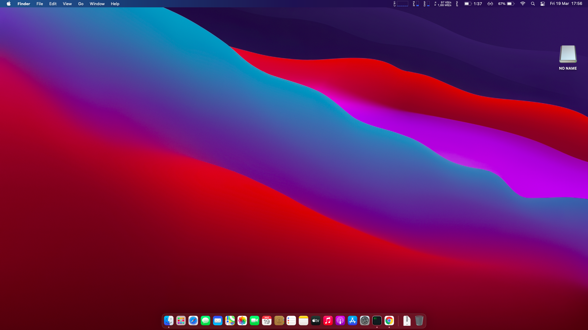
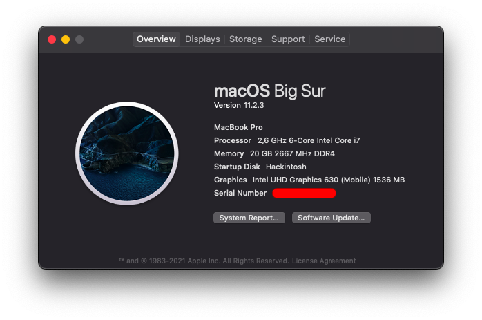
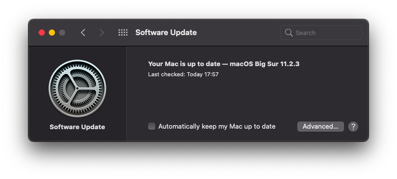
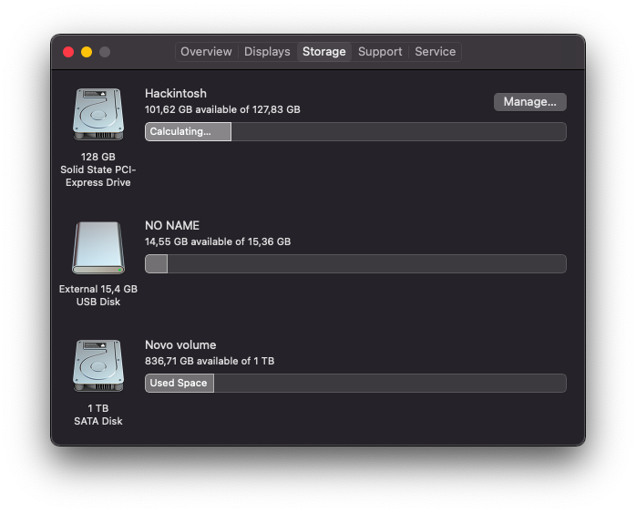
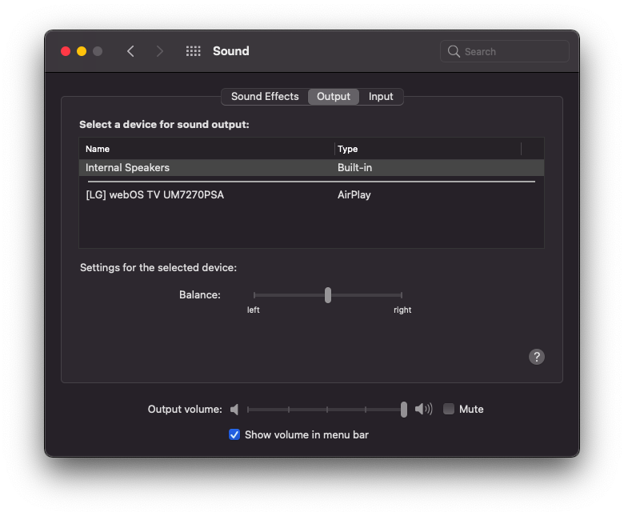
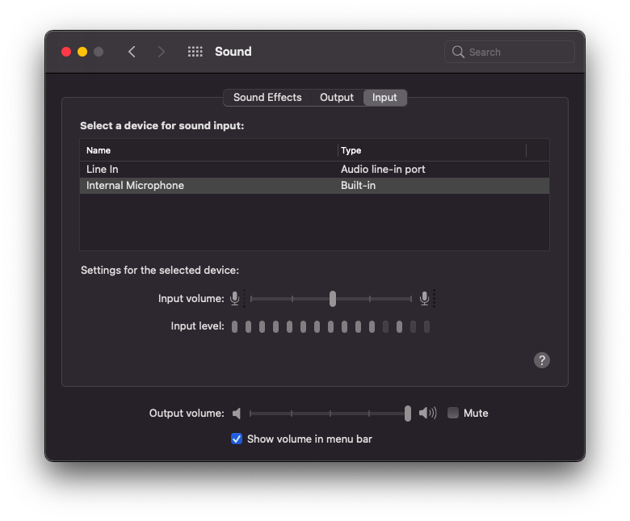
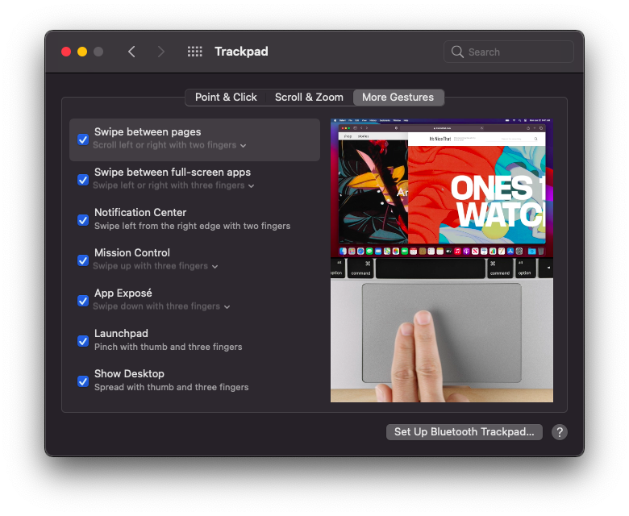
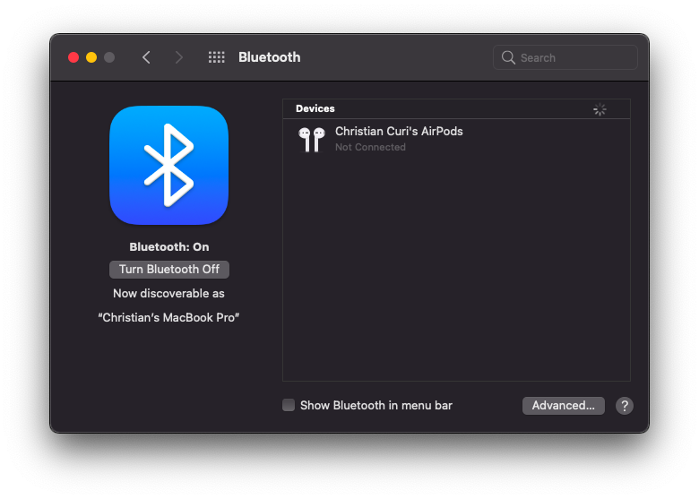
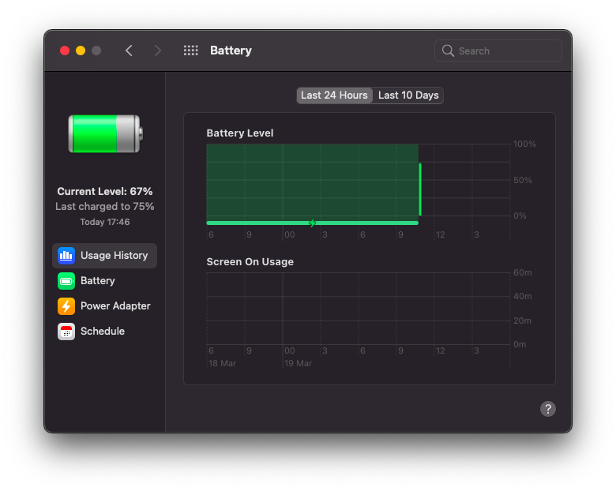
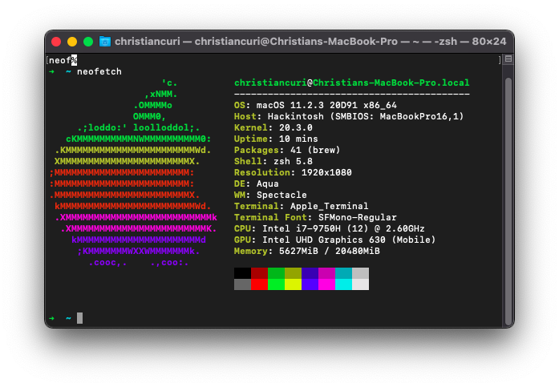

# Acer Nitro 5 AN515-54 Hackintosh

### Supports MacOS 10.15.x ~ 11.0.x

## My System

- Intel i7-9750H
- Intel® UHD Graphics 630 & Nvidia GeForce® GTX 1650
- Intel® Wi-Fi 6 AX200
- 20gb 2666mHZ of DDR4 RAM
- NVME m.2 128GB (replaced to same NVME with 256GB) 

## Important Note

- DWYOR!!!
- Enjoy it while we still can do this
- Set SATA mode to AHCI (Use CTRL+S in BIOS to unhide SATA Mode menu)
- Disable Secure Boot
- Generate new SMBIOS (https://github.com/corpnewt/GenSMBIOS)

## What's Working

- [x] Audio, Input/Mic, Output
- [x] iGPU with disabled dGPU
- [x] Battery Management
- [x] ACPI Display brightness with hot keys / slider
- [x] Ethernet
- [x] Sleep & Wake
- [x] WebCam
- [x] Usb 3.1 & Type C (Mapped USB)
- [x] WiFi & Bluetooth
- [x] Native hotkey support with Fn keys
- [x] Touchpad and gestures
- [x] System Update

## Not working

- HDMI due to Nvidia Optimus
- Nvidia GeForce® GTX 1650 (No Hope....)

## How to use
  1. Create directory "EFI" in your EFI partition (e.g. pendrive or hard drive)
  2. Clone this repo and paste directiories "BOOT" and "OC" onto created directory
  3. Download [**GenSMBIOS**](https://github.com/corpnewt/GenSMBIOS) to generate unique SMBIOS information. Run it and select **Generate SMBIOS**, as model select **MacBookPro16,4**.
  4. Open config.plist with [**ProperTree**](https://github.com/corpnewt/ProperTree) and go to PlatformInfo > Generic. Set MLB (Board Serial), SystemSerialNumber (Serial) and SystemUUID (SmUUID) to generated values.
  5. Boot it! 